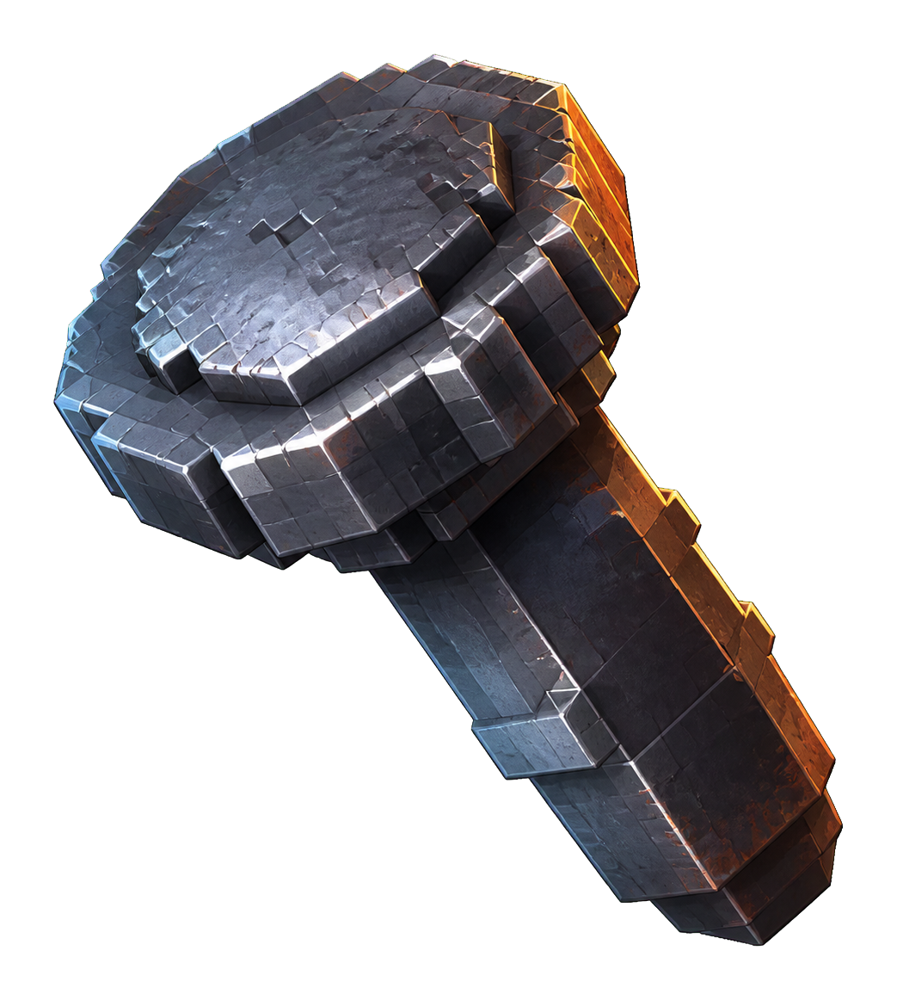

  
  <h1>Rivet</h1>
  
<strong>The Paper Minecraft server, reborn in Rust.</strong>

---

Rivet is a faithful port of [Paper](https://papermc.io) — the world's most-used Minecraft server — to Rust. Same worlds, same gameplay, same plugins. None of the JVM's weight.

- **Drop-in.** Point it at your world, your `server.properties`, your Paper configs. Vanilla parity is measured against the real Java server, chunk by chunk, packet by packet — not promised.
- **Your plugins still work.** Rivet embeds a JVM bridge so existing Paper plugins load unchanged. No rewrites, no forks of your favorite plugins.
- **Rust underneath.** Starts in milliseconds, runs in a fraction of the memory, and whole classes of crashes are compile-time impossible.

## Status

🚧 **Early development — not playable yet.** Currently pinned to Minecraft 26.2. Progress is tracked through five milestones:

| | Milestone | You can… |
|---|---|---|
| M0 | Oracle | run our differential-test harness against the Java server |
| M1 | Join | connect with a real client and walk around an empty world |
| M2 | World | load and generate worlds bit-identical to vanilla |
| M3 | Survival | play: mobs, combat, crafting, redstone |
| M4 | Paper | run Paper plugins via the JVM bridge |

## For contributors (human or agent)

Start with [`GOAL.md`](GOAL.md) — it indexes every design doc and the rules of engagement.

## License & provenance

Private, source-available-to-collaborators for now. Rivet is an independent project, not affiliated with Mojang, Microsoft, or PaperMC. It references Paper's sources (GPL-3/MIT for Paper's own code) as porting ground truth; see `DECISIONS.md` for the full provenance posture.
